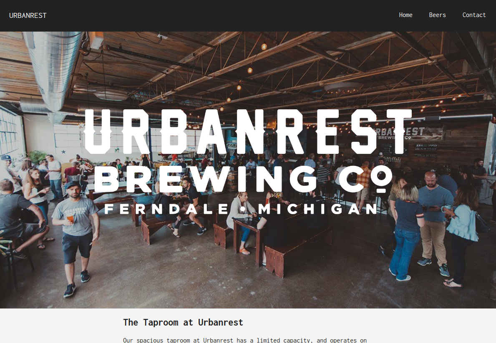
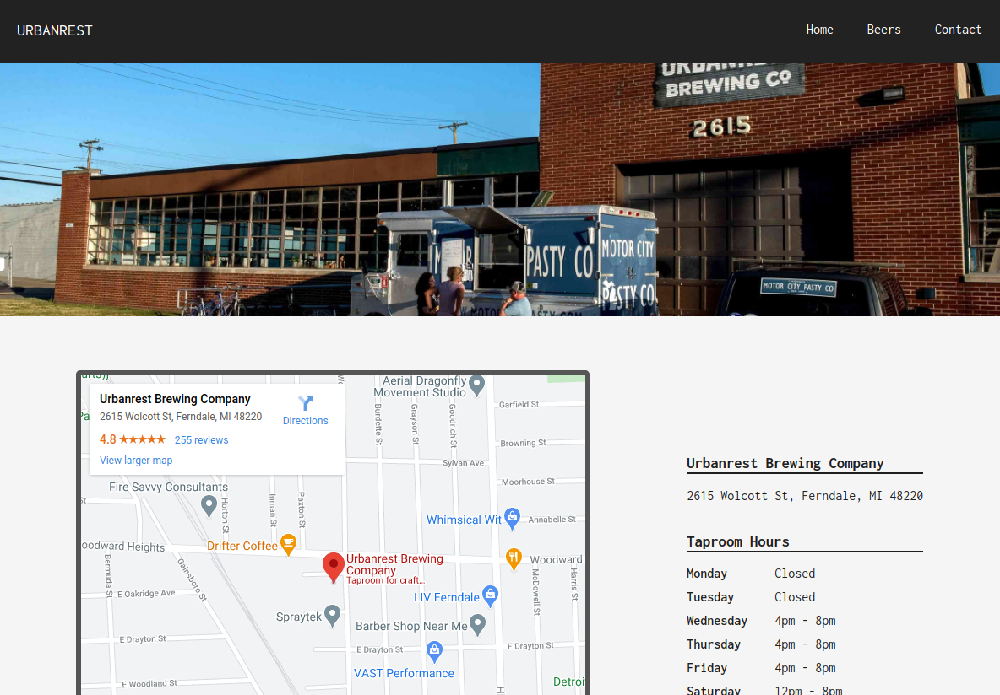

# Mock Restaurant Page
A brewery page created using JavaScript and Webpack.
It is a real brewery that I pulled inspiration, text, and images from for this proof of knowledge / personal learning project.

The purpose of this project was to use and learn webpack. Using dynamic DOM manipulation with JavaScript alone to generate entire website contents.

[Check it](https://jmilll.github.io/restaurant-page/)

## Example

[Check it](https://jmilll.github.io/restaurant-page/)

## Features

* Webpack Bundle

## Motivation

The purpose of this project was to use and learn webpack. Using dynamic DOM manipulation with JavaScript alone to generate entire website contents.

## Technologies Used

* Webpack
* JavaScript
* HTML / CSS
* Flexbox

## Acknowledgements

This project was inspired by [The Odin Project](https://www.theodinproject.com/courses/javascript/lessons/restaurant-page) online learning curriculum.

## License

MIT